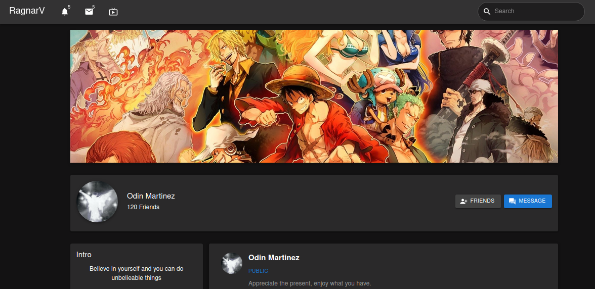

# Facebook Modern Clone App

A simple clone of Facebook demonstrating basic functionality with protected routes and essential views. This project includes user authentication and a few core pages to illustrate the concept of a social media application.





## Features

- **Protected Routes**: Secure access to certain pages.
- **Login and Register**: User authentication pages.
- **Home Page**: Main dashboard after logging in.
- **Profile Page**: User profile view and update.

## Technologies Used

- **Frontend**: Vite | React JS | MaterialUI

## Installation

### Prerequisites

Ensure you have the following installed:

- Node.js (v18 or newer)

### Clone the Repository

```bash
git clone https://github.com/odindevv/facebook-modern-clone.git
